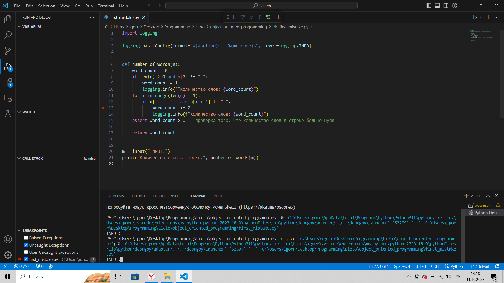
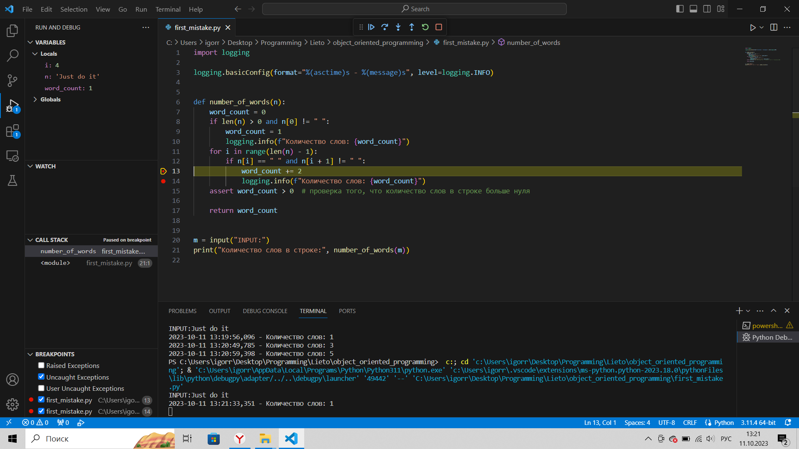
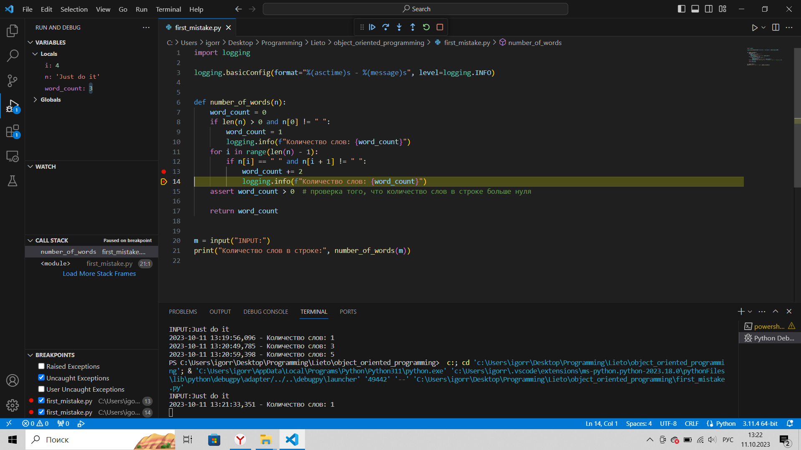

### __Отладка и логирование__
Пошаговая отладка программ на Python
Microsoft Visual Studio Code
Файл first_mistake.py

В коде намеренно допущена ошибка в 13 строке. К переменной "word_count" добавляется 2, а не 1. в следствии чего результат не верный.


1. Запуск программы в режиме отладки

2. Ввод запрашиваемых данных

3. Останов до присвоения нового значения переменной word_count

4. Останов после присвоения нового значения переменной word_count


Код:

```python
import logging

logging.basicConfig(format="%(asctime)s - %(message)s", level=logging.INFO)


def number_of_words(n):
    word_count = 0
    if len(n) > 0 and n[0] != " ":
        word_count = 1
        logging.info(f"Количество слов: {word_count}")
    for i in range(len(n) - 1):
        if n[i] == " " and n[i + 1] != " ":
            word_count += 2
            logging.info(f"Количество слов: {word_count}")
    assert word_count > 0  # проверка того, что количество слов в строке больше нуля

    return word_count


m = input("INPUT:")
print("Количество слов в строке:", number_of_words(m))


```